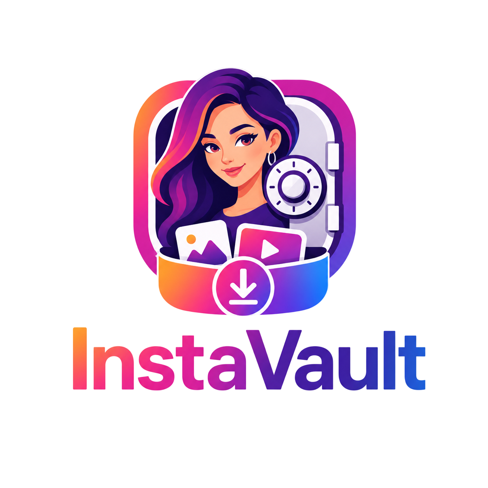

<p align="center">
  
</p>

<h1 align="center">InstaVault</h1>

<p align="center">
  <strong>Archivador privado de perfiles de Instagram.</strong><br/>
  Publicaciones, stories, highlights y fotos de perfil en máxima calidad,<br/>guardados como BLOB dentro de una biblioteca SQLite local.
</p>

<p align="center">
  
  
  
  
  
  
  
</p>

---

## ✨ Características

### Cuentas y sesiones
- **Modo público sin cookies**: buscar, sincronizar y descargar perfiles públicos no lee el llavero ni inicia la sesión de Instagram.
- **Aislamiento estricto**: la navegación pública usa un perfil temporal descartable sin cuenta. Nunca acepta un `accountId`, consulta el llavero ni cae automáticamente al modo privado.
- **Sesión privada explícita**: sólo se inicia desde “Acceso privado” en un navegador visible y dedicado. La app no copia sus cookies a Rust ni al cliente HTTP.
- Las cuentas creadas por versiones anteriores quedan como `reconnect_required`; al reconectar se elimina su credencial legacy del llavero.
- Abrir la app, la biblioteca o un perfil guardado genera cero tráfico a Instagram.

### Perfiles
- Búsqueda por username mediante un **motor CDP** (Instagram bloquea los clientes HTTP externos; la app navega con un Chrome propio).
- Datos completos: nombre, bio, seguidores, seguidos, privacidad, foto de perfil en HD (descargada y guardada localmente).
- **Favoritos** y estadísticas por perfil y por tipo de contenido.

### Contenido
- **Posts**: feed con paginación, carruseles (item por item) y videos.
- **Stories** activas.
- **Highlights**: lectura conservadora desde la web, limitada a cinco elementos por acción explícita.
- **Sincronización explícita**: pulsa Sincronizar para consultar el tipo de contenido elegido. Abrir un perfil solo lee la biblioteca local.
- Si Instagram exige login para contenido público, la app informa la restricción y no recurre a cookies. Las respuestas HTML, restricciones y sesiones rechazadas se muestran como errores, no como álbumes vacíos.

### Descargas
- **Mejor candidato disponible en la página**: fotos por área/ancho/tamaño conocido y videos por área/bitrate/tamaño/ancho. Si Instagram no permite verificarlo se marca `quality_verified=false`.
- **Download manager**: concurrencia configurable, progreso por ítem y panel de jobs. Las descargas CDN no reciben cookies de Instagram.
- **Deduplicación por `media_id`** y SHA-256 dentro de SQLite.
- **Re-descargar** reemplaza el BLOB y **vaciar el álbum** elimina sus BLOB asociados.
- **Álbum por perfil**: grilla de lo descargado con lightbox. Los bytes permanecen dentro de SQLite y **“Guardar en dispositivo”** exporta una copia al destino que elijas.
- **Actualizaciones automáticas firmadas** desde GitHub Releases, con comprobación al iniciar y desde “Acerca de”.

### Biblioteca local
- SQLite (modo WAL): perfiles, medios, highlights, jobs y estado de cada descarga, con reintentos de fallidos.
- Interfaz en español con Tailwind CSS 4, shadcn/ui, Motion, Lucide, Sonner y tema oscuro accesible.

---

## 🚀 Instalación

### Requisitos
- [Rust](https://rustup.rs) (toolchain estable)
- [Node.js](https://nodejs.org) 18+ (probado con 24)
- Windows x64

```bash
# Clonar
git clone https://github.com/Xainner/instavault.git
cd instavault

# Dependencias
npm install

# Desarrollo (hot-reload)
npm run tauri dev

# Build de producción (instalador NSIS en Windows x64)
npm run tauri build
```

> El binario final queda en `src-tauri/target/release/instavault.exe` y los bundles en `src-tauri/target/release/bundle/`.

### Primeros pasos
1. **Perfiles** → buscá un username en modo público; no necesitas configurar una cuenta.
2. **Acceso privado** → conecta el navegador dedicado únicamente si quieres acceder a contenido privado autorizado.
3. **Descargar pendientes** → fotos, videos y avatares se guardan como BLOB dentro de `%APPDATA%/com.xainner.instavault/instakeeper.db`.
4. **Álbum** → mira lo descargado, expórtalo con “Guardar en dispositivo” o vuelve a descargarlo en máxima calidad.

---

## 🏗️ Arquitectura

```
src-tauri/
├── src/
│   ├── lib.rs               # Arranque, plugins (dialog/opener) y registro de comandos
│   ├── commands.rs          # Comandos IPC expuestos al frontend
│   ├── creds.rs             # Limpieza de credenciales legacy del keyring
│   ├── db.rs                # Capa SQLite: esquema, CRUD, jobs y stats (con tests)
│   └── instagram/
│       ├── client.rs        # Cliente sin estado para URLs CDN seleccionadas
│       ├── api.rs           # Selección determinista del mejor candidato
│       ├── provider.rs      # Proveedores web público y privado aislados
│       ├── models.rs        # DTOs de la API + modelos de BD
│       ├── cdp_login.rs     # Motor CDP: Chrome propio, login asistido, navegación,
│       │                    #   captura de respuestas y fallback DOM
│       └── download.rs      # Pipeline BLOB: concurrencia, hash y progreso
src/
├── App.tsx                  # Shell local: vistas y estadísticas
├── components/
│   ├── Sidebar.tsx          # Navegación, logo y badge de descargas activas
│   ├── AccountsView.tsx     # Conexión privada mediante navegador dedicado
│   ├── ProfilesView.tsx     # Biblioteca de perfiles, búsqueda y favoritos
│   ├── MediaDetail.tsx      # Explorador: pestañas, grilla, lightbox, álbum
│   ├── Downloads.tsx        # Download manager (jobs, progreso, provider global)
│   ├── Toasts.tsx           # Notificaciones no intrusivas
│   └── Modal.tsx            # Diálogos de confirmación
├── lib/api.ts               # Wrapper tipado del IPC (invoke)
└── types.ts                 # Tipos compartidos frontend ↔ backend
```

### Notas de ingeniería
- **CDP (Chrome DevTools Protocol)**: la ruta pública levanta un navegador temporal sin cuenta; la privada usa un perfil dedicado y visible. Se capturan sólo los JSON que la web produce y un resumen DOM sin secretos.
- **Límites**: la compatibilidad con perfiles arbitrarios depende de la web no oficial de Instagram. Un bloqueo público se informa y nunca activa una sesión privada por sí solo.
- **Avatares**: se guardan durante una búsqueda explícita y después se sirven exclusivamente desde SQLite.
- **Datos**: `%APPDATA%/com.xainner.instavault/instakeeper.db` (SQLite WAL). No se crean archivos de medios independientes salvo al exportarlos.

---

## 🗺️ Roadmap

- [x] Modo público anónimo y sesión privada dedicada
- [x] Perfiles con búsqueda CDP, favoritos y stats
- [x] Posts (carruseles/videos), stories y highlights
- [x] Persistencia SQLite con deduplicación y reintentos
- [x] Download manager con progreso y jobs
- [x] Selección del mejor candidato disponible y trazabilidad de calidad
- [x] Álbum por perfil, re-descarga y “Guardar en este equipo”
- [ ] Adaptadores para futuros cambios de la web de Instagram
- [ ] Exportación/búsqueda avanzada de la biblioteca local
- [ ] Publicaciones guardadas y etiquetadas

## ⚖️ Aviso legal

InstaVault se desarrolla con fines **personales y educativos** para archivar contenido al que ya tenés acceso. La descarga automatizada puede violar los [Términos de uso de Instagram](https://help.instagram.com/581066165581870) y los derechos de propiedad intelectual de los creadores. Usá esta herramienta bajo tu propia responsabilidad, preferentemente con tu propia cuenta y respetando a los autores.

## 📄 Licencia

[MIT](LICENSE)

---

<p align="center">
  Hecho con <a href="https://www.rust-lang.org">Rust</a> y <a href="https://tauri.app">Tauri</a>.
</p>
